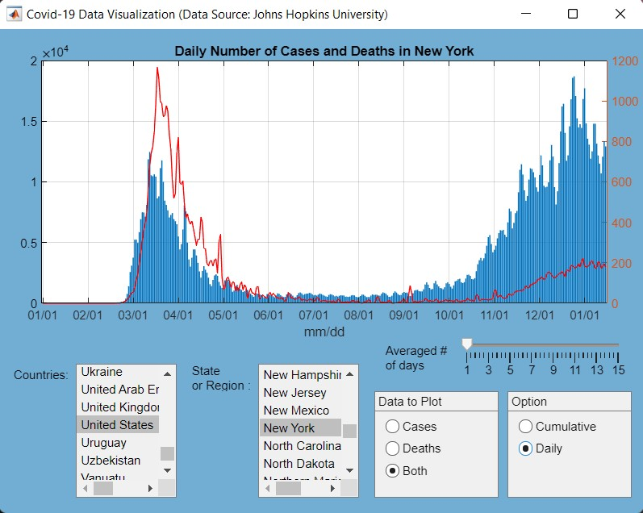

# Covid-19-Visualization-App
The goal of this project was to create a MATLAB program that processes and visualizes COVID-19 pandemic data. The data was obtained from the [Coronavirus Resource Center](https://coronavirus.jhu.edu/map.html) at the Johns Hopkins University. 

The [data](https://github.com/CSSEGISandData/COVID-19) is converted into a .mat file. Once you load it, you will get a single variable called covid_data that is a large cell array. It contains the global case and death counts by country and state and by date. Specifically, the first row of the cell array specifies what each column contains: Country and State followed by a number of dates starting from "1/22/20," that is, January 22, 2020. 

The graphical user interface contains a number of widgets:

* A single area where the data is plotted. The title of the plot displays what country/state is being shown and also indicates the relevant options that were used to generate the plot.

* A list box showing all available countries. The first element is called "Global" and selecting it plots the global data. 
* Another list box showing all states of the currently selected country. The first option is "All." As most countries do not have states, regions, territories or provinces associated with them in the database, this will be the only option for them. Selecting it should show the data for the country itself. 
* A widget to select the number of days used for computing a moving average of the data (from 1 to 15). Selecting 1 means no averaging.
* A widget to select what to plot: cases, deaths, or both.
* A widget to select whether to plot cumulative data or daily numbers. 

Below is a screen shot of the GUI.

### How to Run the App ?
#### Without MATLAB
The [MyAppInstaller_mcr.exe](https://github.com/clairevania/Covid-19-Visualization-App/blob/main/MyAppInstaller_mcr.exe) in the repository is a stand-alone application that runs without MATLAB. Download it from the repository and install it. The app then should be good to go ! 

#### With MATLAB
1. Make sure that the current directory for MATLAB has all the files in myapp folder.
2. Type CovidApp in the command prompt 

